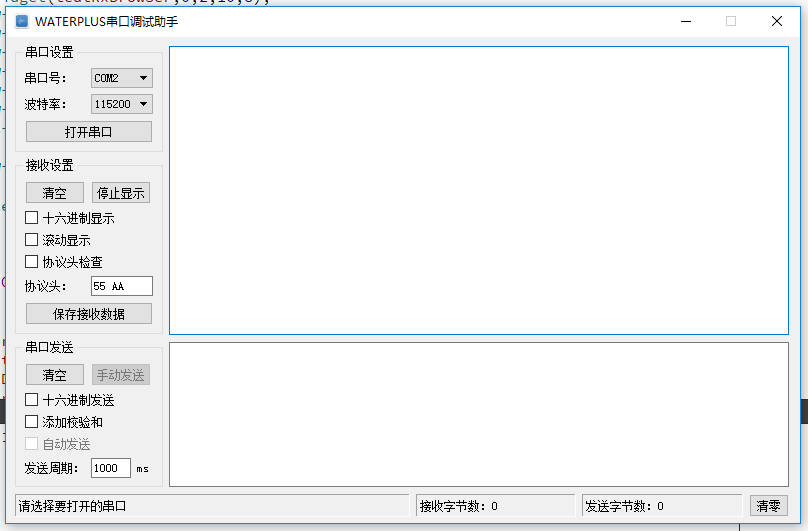

# Windows平台串口调试助手

## 使用预览

## 使用说明
程序基于Qt Creator 4.4.1编写，在Win10、Win7操作系统测试。界面参考“串口调试助手V2.2”。
1. 访问[QT网站](https://www.qt.io/)，注册并下载QT Creator IDE。
2. 下载“Waterplus串口调试助手”源代码。
3. 安装并打开QT Creator，通过“文件->打开文件或项目”操作打开源码中的工程文件，编译运行，或根据需要进行修改。也可以直接使用Release文件夹中打包好的应用程序。
4. 先设置好串口的波特率，然后打开串口进行读写。其他参数默认为：无校验位，8数据位，1停止位，无流控制。

## 功能特点
1. 软件用C/C++语言+Qt方式编写。代码简单，适合初学者参考。
2. 实现对串口的读取与写入，提供16进制与字符方式两种显示方式。
3. 支持接收数据保存至文本。
4. 支持自动发送，自定义发送周期。
5. 自动识别已有串口。